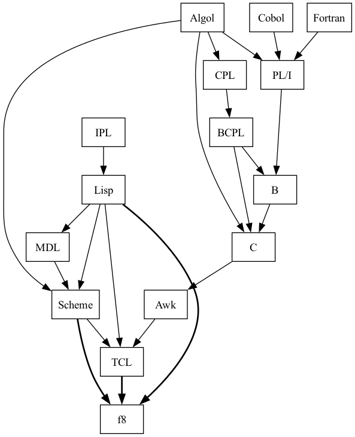

# F8 (fate)

The *F8 (fate)* scripting language is a hybrid dialect of Lisp, Scheme and TCL: 

It has been designed to be small, easy to expand and easy to embed in host applications. 
The core of the language is made of a single [C++ header](src/core.h) (~ 1000 loc in total) and a  [small library](src/stdlib.tcl) written using *F8* itself.

*F8* includes several neat features, among which:

* homoiconicity and introspection
* tail recursion
* static and dynamic scoping
* partial evaluation
* lambda functions with closures

For an overview on the language, please see [this example](examples/overview.tcl); for an example on how to integrate the language in your application, please check the [main file](src/f8.cpp).

### Building

To compile, from root folder type:

`mkdir build`

`cd build`

`cmake ..`

`make`

(c) 2024 www.carminecella.com

